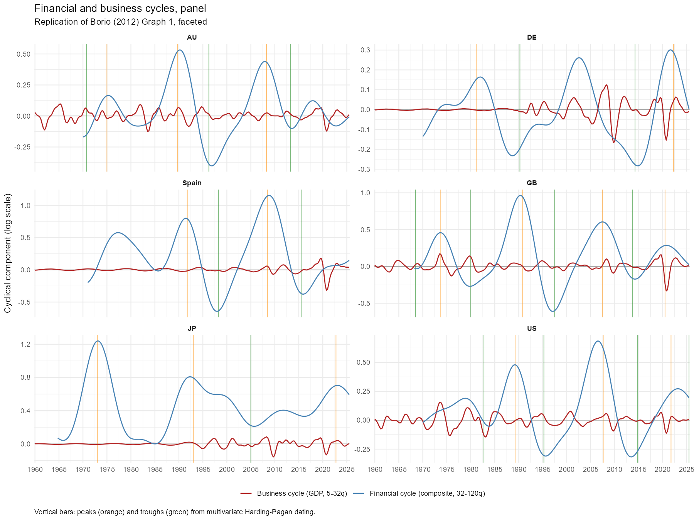
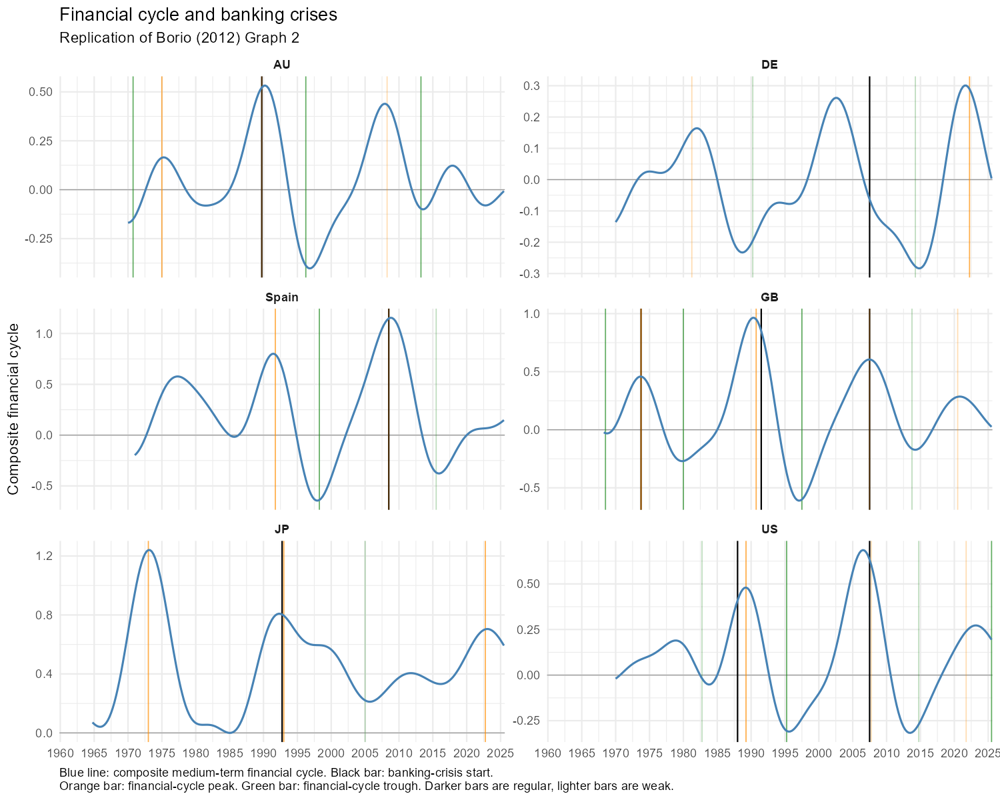

# Financial cycle dating

Replicates the BIS medium-term financial cycle framework from [Borio (2012)](https://www.bis.org/publ/work395.htm) and [Drehmann, Borio & Tsatsaronis (2012)](https://www.bis.org/publ/work380.htm) for six economies: US, UK, Japan, Australia, Germany and Spain. The original papers were published in 2012 — this repo extends the methodology to current data (2025 Q3) to ask what the framework says now.

## Key points

**1. What the financial cycle is**

The financial cycle tracks the joint co-movement of real bank credit, the credit-to-GDP ratio and real residential property prices. It runs on a 16-20 year rhythm, far longer and larger than the 1-8 year GDP business cycle. Standard output gaps miss it: a financial boom can build for years while inflation stays quiet and headline gaps sit near zero. The financial cycle is the complementary thermometer.

**2. Stylised facts**

- Amplitude is roughly four times the business cycle in most countries.
- Length averages 16-20 years peak-to-peak, against 5-8 years for the GDP cycle.
- Peaks precede systemic banking crises — the build-up is visible well before GDP or CPI signal trouble.
- Cross-country timing diverges sharply: whether a country is a domestic borrower or a creditor to foreign booms determines whether its cycle co-moves with global stress or sits flat through it.

**3. Where countries stand now (2025 Q3)**

- **Japan** (+0.59 above baseline): still the most elevated in level terms, carrying the overhang of the late-1980s bubble; past a 2022 Q4 peak and unwinding slowly.
- **US** (+0.19): modestly above the 1985 baseline, with an end-of-sample trough marker; roughly neutral after the 2022-2024 hiking cycle.
- **Spain** (+0.15): mid-cycle and climbing after a deep GFC and sovereign-debt trough in the mid-2010s — a classic borrower-side cycle where the 2008 Q3 systemic crisis start sat directly on a joint financial-cycle peak.
- **Germany** (≈ 0): past a 2022 Q2 peak; unwinding but not busting. Germany's 2007-08 banking stress came from foreign subprime exposures, not a domestic credit-and-property build-up — the domestic cycle was flat, so no orange peak appears at 2007. The opposite archetype to Spain.
- **UK** (≈ 0): past a 2020 Q3 peak; orderly deflation rather than outright bust. The 2008 episode was domestic (like Spain), so the crisis line lines up with a peak.
- **Australia** (≈ 0): near the 1985 baseline; quiet since the post-mining trough in 2013 Q2.

## Charts

All charts live in `output/charts/`. Each has a matching CSV in `output/data/`.

### `chart_fc_vs_bc_panel.png`: financial vs business cycle, six countries

Medium-term financial cycle (blue) and short-term business cycle in real GDP (red). Orange vertical bars mark joint financial-cycle peaks; green bars mark troughs.

A recession on top of a financial-cycle downturn (1991, 2008) is a different event from a recession inside a financial-cycle expansion (2001). The financial cycle dwarfs the business cycle in amplitude in most panels. Germany is the exception: a comparatively flat domestic cycle reflects creditor-side exposure rather than a home-grown build-up.

### `chart_fc_with_crises.png`: the empirical hook

Financial cycle for each country with systemic banking-crisis start dates (Laeven & Valencia 2018) marked as black vertical lines.

Eight of the nine black lines sit on or beside an orange peak. The single exception is DE 2007: Germany's domestic cycle was flat, so no peak is dated there. This is the chart the policy argument rests on — where a country runs a home-grown credit-and-property build-up, the financial-cycle peak and the banking-crisis start are the same event seen two ways.

Peak labels distinguish strength:
- **Regular**: every component has an own-peak within 6 quarters of the common-cycle date.
- **Weak**: every component is within 12 quarters and at least one is more than 6 away.

## Additional information

### Latest readings

No country is running a live boom. The most acute risk in the original Borio framing — a joint build-up in all three components pushing toward a systemic peak — is not what the data shows today. Japan carries the largest stock overhang by a wide margin, but it is a legacy of the 1990 bubble rather than a fresh accumulation. Europe and the US unwound through the 2020s without a full bust. The more interesting signal is what did *not* happen: the aggressive post-COVID tightening cycle stalled credit and property across most of the panel without triggering the kind of joint collapse the framework would associate with a high-amplitude peak unwind. Spain and Australia sit quietly in mid-cycle after deep prior troughs; a new build-up in either would be the thing to watch.

Composite financial cycle level at 2025 Q3, expressed as deviation from the 1985 Q1 baseline:

| Country | FC level | Most recent turning point | Status |
|---|---|---|---|
| Australia | ≈ 0 | 2013 Q2 trough | Mid-cycle, near baseline |
| Germany | ≈ 0 | 2022 Q2 peak | Past the peak, unwinding |
| Japan | +0.59 | 2022 Q4 peak | Past the peak, persistently elevated |
| Spain | +0.15 | 2015 Q3 trough (weak) | Mid-cycle, climbing after GFC trough |
| UK | ≈ 0 | 2020 Q3 peak | Past the peak, unwinding |
| US | +0.19 | 2025 Q3 trough (live) | Mid-cycle, modestly elevated |

### Methodology

The composite financial cycle is the simple average of three medium-term cycles: real credit, credit-to-GDP and real property prices. Each component is run through a Christiano-Fitzgerald band-pass filter on its annual log-difference with a 32-120 quarter pass-band, then cumulated to a log-level cycle and anchored to zero at 1985 Q1.

Common turning points come from a multivariate Harding-Pagan algorithm. The cluster rule follows DBT (2012, Annex): the distance criterion is from the candidate common-cycle date to each component's own peak, not the spread between component peaks. Full implementation in `01_financial_cycle.R`.

### Reproduce

| Script | What it does |
|---|---|
| `00_data_cleaning.R` | Pulls quarterly credit, property, GDP, CPI and policy rates for the six countries. Caches raw downloads to `input/`. |
| `01_financial_cycle.R` | Runs the medium-term band-pass filter and the multivariate Harding-Pagan turning-point dater. |
| `02_business_cycle.R` | Runs the short-term band-pass filter on real GDP. |
| `03_charts.R` | Builds the two charts and matching CSVs. Run this to reproduce everything. |

One-time setup: a free FRED API key stored as `FRED_API_KEY` in your `.Renviron`. See `input/README.md`.

### Caveats

- **Filter edge effects.** The Christiano-Fitzgerald band-pass has large endpoint distortions in the final roughly five years. Recent peaks and troughs will revise as more data arrives.
- **Two-sided filter.** This is a full-sample retrospective view, not what would have been visible to a policymaker in real time.
- **Australian GDP.** ABS recently revised its national-accounts methodology. Long-run real GDP back-data may differ slightly from BIS-archived series.

### Papers

- `papers/Borio (2012).pdf`: *The financial cycle and macroeconomics: what have we learnt?* BIS Working Paper No. 395. The conceptual paper.
- `papers/Drehmann Borio Tsatsaronis (2012).pdf`: *Characterising the financial cycle: don't lose sight of the medium term!* BIS Working Paper No. 380. The empirical method.
